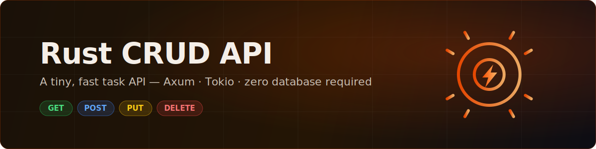
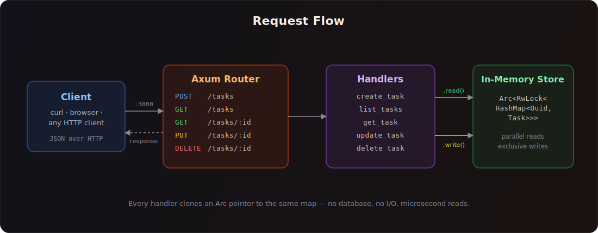
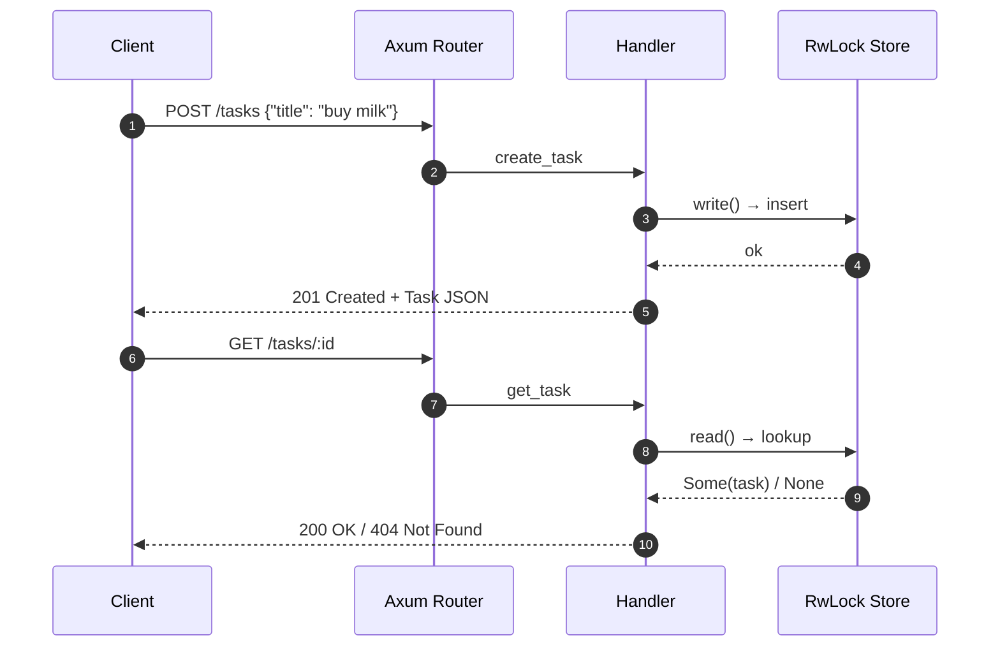

<div align="center">



**A tiny, blazing-fast task API built with [Axum](https://github.com/tokio-rs/axum) and [Tokio](https://tokio.rs) — no database required.**

[](https://www.rust-lang.org/)
[](https://docs.rs/axum/0.7)
[](https://tokio.rs)
[](#-contributing)

[Quick Start](#-quick-start) · [API Reference](#-api-reference) · [Architecture](#-architecture) · [Performance](#-performance-notes)

</div>

---

## ✨ Features

- ⚡ **Fast by default** — pure in-memory storage behind an `RwLock`, so reads never wait on each other
- 🧩 **Complete CRUD** — create, list, get, update, and delete tasks over clean JSON endpoints
- 🪶 **Featherweight** — five source files, four direct dependencies, zero database setup
- 🦀 **Idiomatic Rust** — typed extractors, `Result`-based error handling, and proper HTTP status codes
- 📦 **Tuned release builds** — thin LTO, single codegen unit, and stripped symbols out of the box

## 🏗 Architecture



Every request flows through three layers:

1. **Router** ([router.rs](src/router.rs)) — maps each method + path to a handler and injects shared state.
2. **Handlers** ([handlers/task.rs](src/handlers/task.rs)) — deserialize the request, touch the store, and shape the HTTP response.
3. **Store** ([models/task.rs](src/models/task.rs)) — an `Arc<RwLock<HashMap<Uuid, Task>>>`: the `Arc` gives every handler a cheap clone of the same map, and the `RwLock` lets any number of `GET`s proceed in parallel while writes take brief exclusive access.

### The life of a task



## 🚀 Quick Start

All you need is a [Rust toolchain](https://rustup.rs).

```bash
git clone <your-repo-url> rust-crud-app
cd rust-crud-app
cargo run
```

The server starts on **http://localhost:3000**:

```
listening on http://0.0.0.0:3000
```

For an optimized production binary:

```bash
cargo build --release
./target/release/crud-app
```

## 📖 API Reference

| Method   | Endpoint     | Description            | Success            | Failure |
| -------- | ------------ | ---------------------- | ------------------ | ------- |
| `POST`   | `/tasks`     | Create a task          | `201` + task JSON  | —       |
| `GET`    | `/tasks`     | List all tasks         | `200` + task array | —       |
| `GET`    | `/tasks/:id` | Fetch one task         | `200` + task JSON  | `404`   |
| `PUT`    | `/tasks/:id` | Update title and/or done | `200` + task JSON | `404`   |
| `DELETE` | `/tasks/:id` | Delete a task          | `204` (no body)    | `404`   |

### The `Task` object

```json
{
  "id": "746e7fd3-afda-48a1-8144-4b8ebf8ecd59",
  "title": "buy milk",
  "done": false
}
```

### Examples

**Create a task**

```bash
curl -X POST http://localhost:3000/tasks \
  -H 'Content-Type: application/json' \
  -d '{"title": "buy milk"}'
```

```json
{"id":"746e7fd3-afda-48a1-8144-4b8ebf8ecd59","title":"buy milk","done":false}
```

**List every task**

```bash
curl http://localhost:3000/tasks
```

**Mark it done** — `title` and `done` are both optional, so send only what you want to change:

```bash
curl -X PUT http://localhost:3000/tasks/746e7fd3-afda-48a1-8144-4b8ebf8ecd59 \
  -H 'Content-Type: application/json' \
  -d '{"done": true}'
```

```json
{"id":"746e7fd3-afda-48a1-8144-4b8ebf8ecd59","title":"buy milk","done":true}
```

**Delete it**

```bash
curl -X DELETE http://localhost:3000/tasks/746e7fd3-afda-48a1-8144-4b8ebf8ecd59
# → 204 No Content
```

## 📂 Project Structure

```
rust-crud-app/
├── Cargo.toml              # dependencies + tuned release profile
├── assets/                 # README illustrations
└── src/
    ├── main.rs             # entry point: builds state, binds :3000, serves
    ├── router.rs           # route table → handler wiring
    ├── handlers/
    │   └── task.rs         # the five CRUD handlers
    └── models/
        └── task.rs         # Task, CreateTask, UpdateTask, Db type alias
```

## ⚙️ Performance Notes

Small app, deliberate choices:

- **`RwLock` over `Mutex`** — list and get handlers take a shared read lock, so concurrent reads never serialize; only create/update/delete take the exclusive write lock.
- **Tight lock scopes** — every handler acquires the lock, does the minimum work, and drops it before serializing the response.
- **Trimmed Tokio features** — the app compiles against `rt-multi-thread`, `macros`, and `net` instead of `full`, which cuts compile time and dependency surface.
- **Release profile** — `lto = "thin"`, `codegen-units = 1`, and `strip = true` produce a smaller, faster binary with no code changes.

> **Heads-up:** storage is in-memory by design — restart the server and the tasks are gone. Perfect for demos, prototypes, and learning Axum; swap the `Db` type alias for a real database when you need persistence.

## 🗺 Roadmap

- [ ] Persistence layer (SQLite via `sqlx`)
- [ ] Input validation (reject empty titles)
- [ ] Pagination for `GET /tasks`
- [ ] Integration tests with `tower::ServiceExt`
- [ ] Dockerfile + CI workflow

## 🤝 Contributing

Issues and pull requests are welcome. Keep the spirit of the project: small, readable, and idiomatic.

---

<div align="center">
Built with 🦀 and a single <code>HashMap</code>.
</div>
